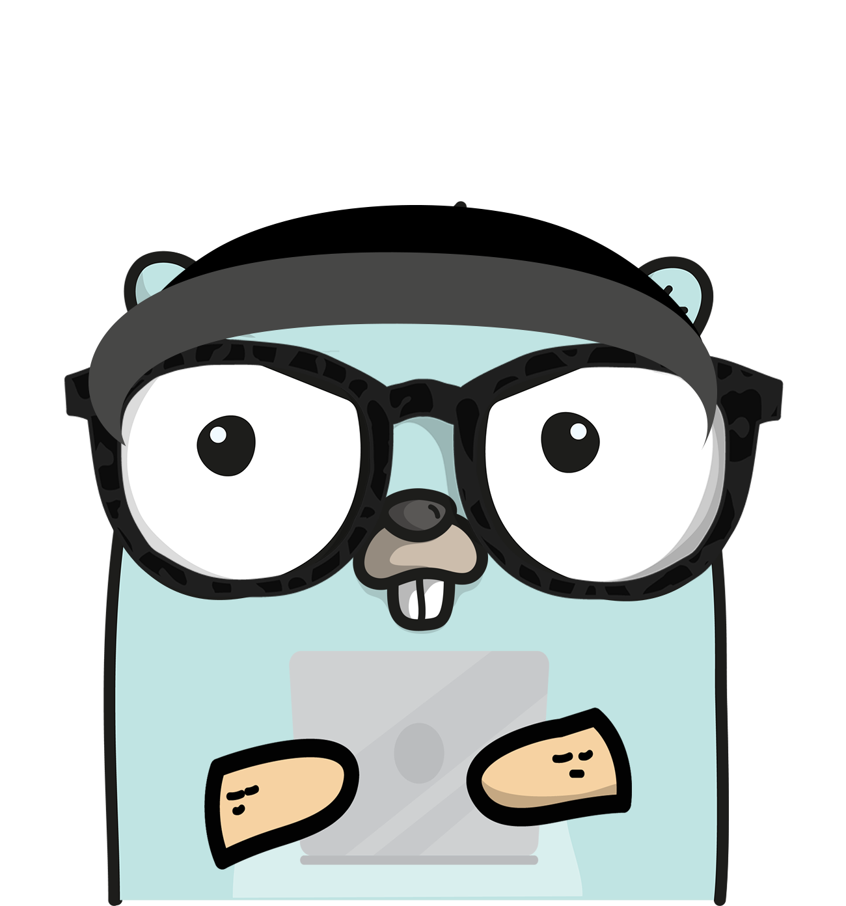
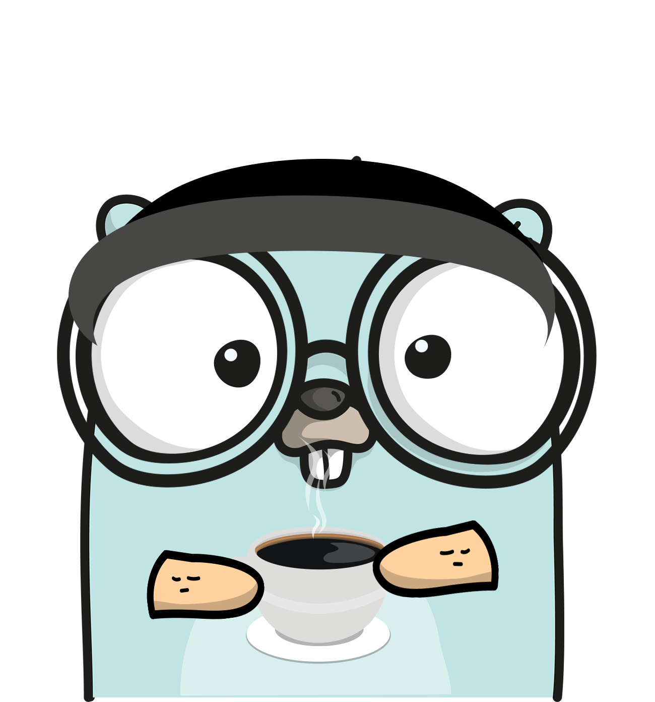
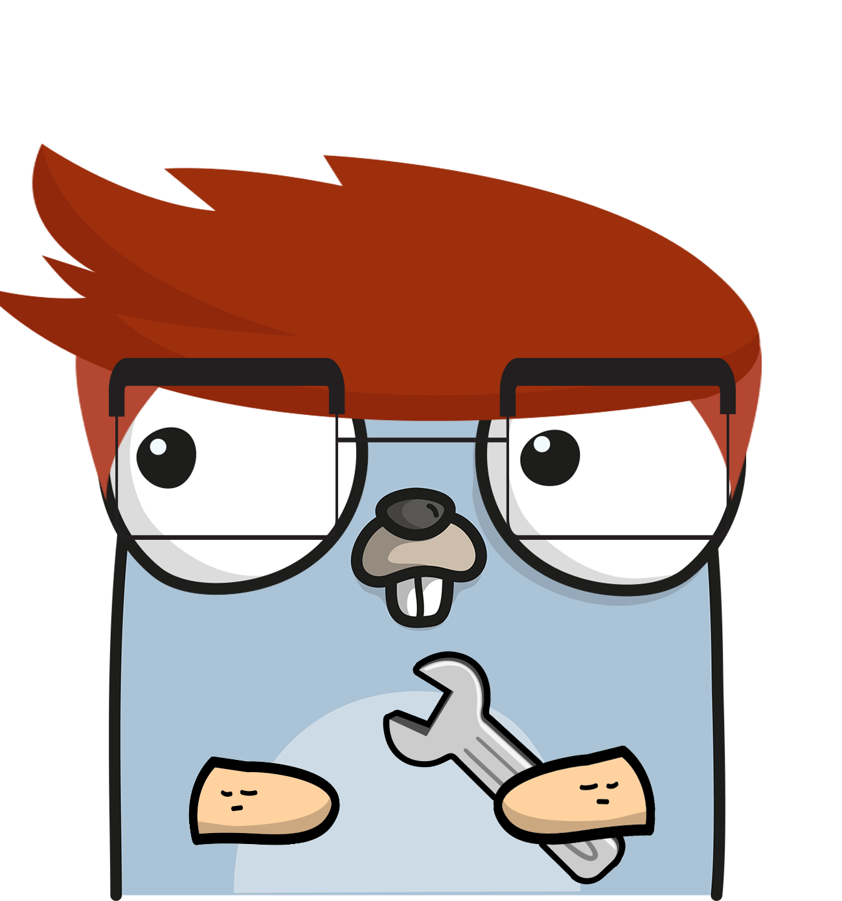

# Estudando Golang
Estou iniando meus estudos com a linguagem Go no inicio de 2022 e resolvi usar este repositório para documentar minha jornada e compartilhar para que outras pessoas possam usar como referencia de estudo.   

**Tabela de Contexto**

- [Estudando Golang](#estudando-golang)
  - [Roteiro de Estudo](#roteiro-de-estudo)
  - [Labs](#labs)
  - [FAQ](#faq)
    - [Porque utilizar o Gin Web Framework?](#porque-utilizar-o-gin-web-framework)
    - [Porque utilizar o GORM?](#porque-utilizar-o-gorm)
  - [Links](#links)
    - [Tutoriais](#tutoriais)
    - [Cursos e tutoriais em vídeo _Gratuitos_](#cursos-e-tutoriais-em-vídeo-gratuitos)
    - [Livros](#livros)
    - [Framworks e bibliotecas](#framworks-e-bibliotecas)
    - [Diversos](#diversos)

 

## Roteiro de Estudo

- [ ]  Estudo de conceitos básicos da linguagem usando o Curso no Youtube → [Aprenda Go](https://www.youtube.com/playlist?list=PLCKpcjBB_VlBsxJ9IseNxFllf-UFEXOdg)
- [ ]  Implementar CRUD API com dados estáticos usando → **[Gin Web Framework](https://github.com/gin-gonic/gin)**
- [ ]  Refactoring para Arquitetura Hexagonal usando Dependence Injection com → **[Wire](https://github.com/google/wire)**
- [ ]  Implementar Persistencia usando → **[GORM](https://gorm.io/)**
- [ ]  Implementar Swagger Documentation com → [Swag](https://github.com/swaggo/swag)
- [ ]  Implementar Integração Assíncrona com Kafka usando → **[gogen-avro](https://github.com/actgardner/gogen-avro)**
- [ ]  Implementar Autenticação JWT  usando → **[jwt-go](https://github.com/golang-jwt/jwt)**
- [ ]  Criar um repositório no Github usando como exemplo → [este repositório](https://github.com/akutz/go-generics-the-hard-way#how-are-you-using-generics-in-the-go-playground)

 

## Labs

Abordagem prática para aprender o _Go em Desenvolvimento Web_

1. [**Prerequisites**](./labs/01-prereqs/): como instalar os pré-requisitos necessários para executar os exemplos neste repositório
2. [**Hello world**](./labas/02-hello-world/): um exemplo simples usando Go para _Desenvolvimento Web_

 

## FAQ

Respostas para algumas das perguntas mais frequentes sobre _Go para Desenvolvimento Web_

* [Porque utilizar o Gin Web Framework?](#porque-utilizar-o-gin-web-framework)   
* [Porque utilizar o GORM?](#porque-utilizar-o-gorm)   

### Porque utilizar o Gin Web Framework?
???

### Porque utilizar o GORM?
???

 

## Links

### [Tutoriais](./links/tutorials/)   

### [Cursos e tutoriais em vídeo _Gratuitos_](./links/free-videos-references/)   

### [Livros](./link/books/)   

### [Framworks e bibliotecas](./links/frameworks-and-libraries/)

### [Diversos](./links/miscellaneous/)