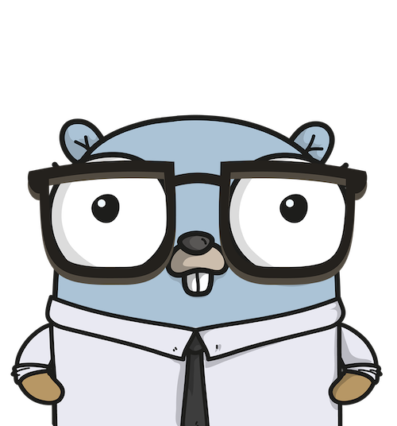

# Estudando Golang

Estou iniando meus estudos com a linguagem Go no inicio de 2022 e resolvi usar este repositório para documentar minha jornada e compartilhar para que outras pessoas possam usar como referencia de estudo.   

:warning: Decidi manter este material ao maximo traduzido para Português para ser mais acessível às pessoas que estão começando e podem não saber Inglês.

---

## O mito da criação de Go   

Existe um mito em torno da criação do Go. A linguagem nasceu dentro de um escritório do Google e aconteceu durante uma construção muito longa que levou 45 minutos.    

Esta história é contada por [Rob Pike](https://pt.wikipedia.org/wiki/Rob_Pike). Ele nos dá uma informação preciosa sobre as motivações por trás da criação do Go. Os tempos de construção eram muito longos e dolorosos... eles tinham que encontrar uma maneira de evitá-los; esse foi o ponto de entrada do Go Genesis.   

[Robert Griesemer](https://en.wikipedia.org/wiki/Robert_Griesemer), [Ken Thompson](https://pt.wikipedia.org/wiki/Ken_Thompson) e [Rob Pike](https://pt.wikipedia.org/wiki/Rob_Pike) são os desenvolvedores que começaram a trabalhar no Go em 2007. Rob Pike afirma que em meados de 2008, a linguagem foi "principalmente projetada e a implementação (compilador, tempo de execução) começando a funcionar. Depois disso, Ian Lance Taylor e Russ Cox se juntaram à equipe em 2008.   

Go é uma linguagem de programação de código aberto mantida por sua comunidade e uma equipe principal de desenvolvedores que trabalham no Google. O dia 16 de março de 2011 é a data do primeiro lançamento do Go. (Foi nomeado "r56"). Go versão 1 foi lançado em 28 de março de 2012. ×

--- 

**Tabela de Contexto**

- [Estudando Golang](#estudando-golang)
  - [O mito da criação de Go](#o-mito-da-criação-de-go)
  - [Roteiro de Estudo](#roteiro-de-estudo)
  - [Labs](#labs)
  - [FAQ](#faq)
    - [Qual foi a motiviação para a criação de Go?](#qual-foi-a-motiviação-para-a-criação-de-go)
    - [Quais as principais features de Go?](#quais-as-principais-features-de-go)
  - [Links](#links)
    - [Tutoriais](#tutoriais)
    - [Cursos e tutoriais em vídeo _Gratuitos_](#cursos-e-tutoriais-em-vídeo-gratuitos)
    - [Livros](#livros)
    - [Framworks e bibliotecas](#framworks-e-bibliotecas)
    - [Diversos](#diversos)

 

## Roteiro de Estudo

- [ ] Estudo de conceitos básicos da linguagem usando o Curso no Youtube → [Aprenda Go](https://www.youtube.com/playlist?list=PLCKpcjBB_VlBsxJ9IseNxFllf-UFEXOdg)
- [ ] Praticar Go usando -> [Practical Go Lessons](https://www.practical-go-lessons.com/)
- [ ] Implementar CRUD API com dados estáticos usando → **[Gin Web Framework](https://github.com/gin-gonic/gin)**
- [ ] Refactoring para Arquitetura Hexagonal usando Dependence Injection com → **[Wire](https://github.com/google/wire)**
- [ ] Implementar Persistencia usando → **[GORM](https://gorm.io/)**
- [ ] Implementar Swagger Documentation com → [Swag](https://github.com/swaggo/swag)
- [ ] Implementar Integração Assíncrona com Kafka usando → **[gogen-avro](https://github.com/actgardner/gogen-avro)**
- [ ] Implementar Autenticação JWT  usando → **[jwt-go](https://github.com/golang-jwt/jwt)**
- [ ] Criar um repositório no Github usando como exemplo → [este repositório](https://github.com/akutz/go-generics-the-hard-way#how-are-you-using-generics-in-the-go-playground)

 

## Labs

Abordagem prática para aprender o _Go em Desenvolvimento Web_

1. [**Prerequisites**](./labs/01-prereqs/): como instalar os pré-requisitos necessários para executar os exemplos neste repositório
2. [**Hello world**](./labs/02-hello-world/README.md): um exemplo simples Hello World em Go
3. [**POO**](./labs/03-oop/README.md)
4. [**Hello world Go Web**](./labs/03-hello-world-web/README.md): um exemplo simples usando Go para _Desenvolvimento Web_

 

## FAQ

Respostas para algumas das perguntas mais frequentes sobre _Go para Desenvolvimento Web_

* [Qual foi a motiviação para a criação de Go?](#qual-foi-a-motiviação-para-a-criação-de-go)   
* [Quais as principais features de Go?](#quais-as-principais-features-de-go)   

### Qual foi a motiviação para a criação de Go?

Go (ou Golang) foi construído pelo Google para resolver os problemas da empresa.    
Quais são os desafios do software em grandes empresas mundiais?   

- [x] A base de código dos serviços do Google é enorme. O Google tem milhões de linhas de código. 
- [x] Essas linhas são escritas em diferentes linguagens: C, C++, Java e outras.
- [x] O tempo de construção desses aplicativos "se estendeu para muitos minutos, até horas". 
- [x] As atualizações de algumas partes do aplicativo podem ser caras.   

O objetivo dos primeiros Gophers era facilitar a vida dos desenvolvedores:   

- [x] Reduzir drasticamente o tempo de compilação dos programas. 
- [x] Projetar uma linguagem que seja fácil de aprender, ler e depurar para um público de jovens desenvolvedores que foram expostos a C, C++ ou Java.
- [x] Projetar um sistema de gerenciamento de dependências eficaz. 
- [x] Constrir uma linguagem que possa produzir software que seja bem dimensionado em hardware.   

> Definições de alguns conceitos
> - <u>**Build time**</u> : a quantidade de tempo necessária para um compilador gerar um executável legível por máquina.
> - <u>**Statically Typed Language**</u> : Dar uma definição precisa deste conceito é agora prematuro. Abordaremos esse termo nos próximos capítulos.
> <u>**Dependency**</u> : um pedaço de software que é usado por outro software.
> - <u>**Scalability**</u> : a capacidade de um programa para lidar com uma quantidade crescente de tarefas a serem executadas. Por exemplo, um site é considerado escalável se puder aceitar um número crescente de solicitações sem tempos de inatividade ou aumento da latência de carregamento.

### Quais as principais features de Go?

Os criadores do Go concentraram seus esforços em várias escolhas críticas de design.:

* Linguagem compilada.
* Semântica fácil de entender e aprender.
* **Estaticamente tipada**.
* **Concorrencia** nativa, um sistema que é fácil para os desenvolvedores trabalharem.
* Gerenciamento de dependência robusto.
* Garbage collector

 

## Links

### [Tutoriais](./links/tutorials/)   

### [Cursos e tutoriais em vídeo _Gratuitos_](./links/free-videos-references/)   

### [Livros](./links/books/)   

### [Framworks e bibliotecas](./links/frameworks-and-libraries/)   

### [Diversos](./links/miscellaneous/)
