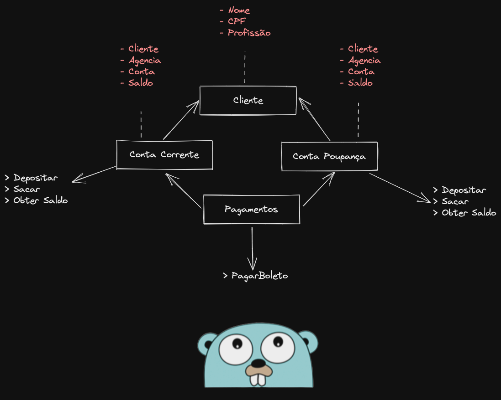

# Laboratório OOP

- [Laboratório OOP](#laboratório-oop)
  - [Desafio](#desafio)
    - [Enunciado](#enunciado)
  - [**<u>Features e convenções:</u>**](#ufeatures-e-convençõesu)
  - [Solução](#solução)

## Desafio

Desafio de Orientação a Objetos.   
Criar um programa de Banco. 

### Enunciado

> **Desafio de Orientação a Objetos**   
> Criar um programar de **<u>Banco</u>**, onde seja possivel:    
> - [x] Criar uma conta com os _atributos:_   
>     * nome do titular
>     * numero da conta
>     * numero da agencia
>     * cpf
>     * saldo
> - [x] Efetuar Deposito     
>     * **<u>Constraint</u>**: Valor deve ser mario que zero
> - [x] Efetuar Saque
>     * **<u>Constraint</u>**: Valor do saque deve ser (>0) e (<=saldo)
> - [x] Efeturar Transferencia entre contar    
>     * **<u>Constraint</u>**: Valor da transferencia deve ser (>0) e (<=saldo)   
> - [x] Obter Saldo
>     * Saldo deve ser privado e ser manipulado apenas através dos métodos
> - [x] Criar tipos de contas: Corrente e Poupança
> - [x] Efeturar pagamento de Boletos que deve receber uma conta(interface) e o valor do boleto
> - [x] Modularizar o código em camandas: app, usecase, domain, infra 

```
.
├── app
│   ├── execute_checking_account.go
│   └── execute_savings_account.go
├── domain
│   ├── account
│   │   ├── checking_account.go
│   │   └── savings_account.go
│   └── customer
│       └── customer.go
├── go.mod
├── infra
│   ├── database
│   │   └── database.go
│   └── integration
│       └── payment_integration.go
├── main.go
└── usecase
    ├── checking_account_usecase.go
    └── savings_account_usecase.go
```


## **<u>Features e convenções:</u>**

* struct 
* associar functions à struct (métodos)
* functions/métodos com multiplos retornos error, valor
* pacotes e vizibilidade
* ponteiros e referencias
* composição de struct
* modularização

:exclamation: Disclamer - Apesar dos nomes das camadas fazerem uma referencia a Arquitetura Limpa ou Hexagonal, neste momento não foi usado ainda este conceito.



## Solução

Veja o [Código](../src/)


